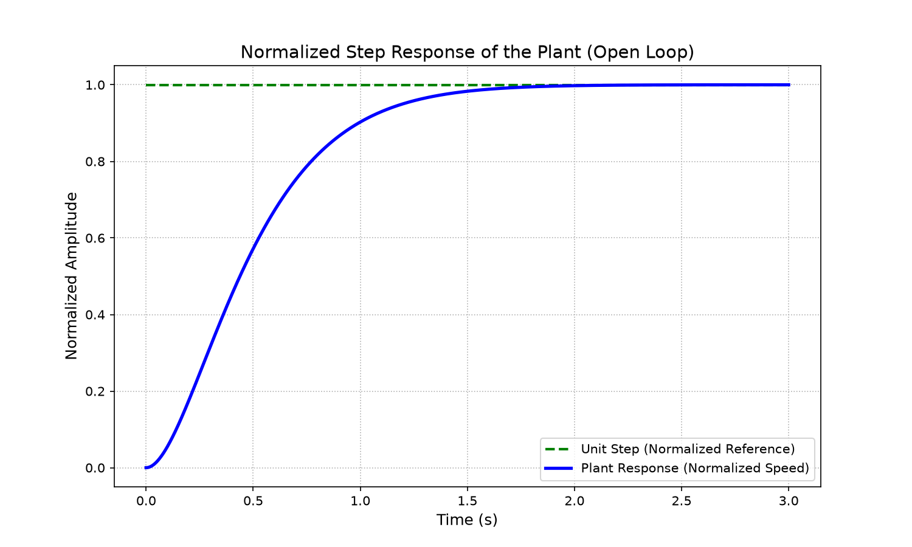
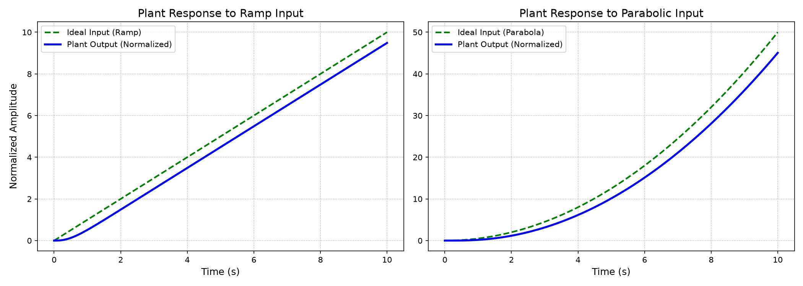
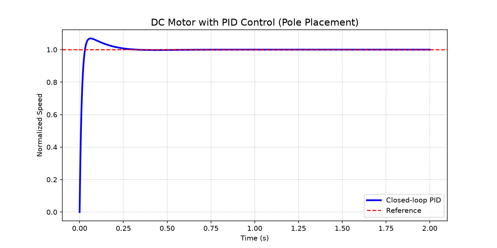
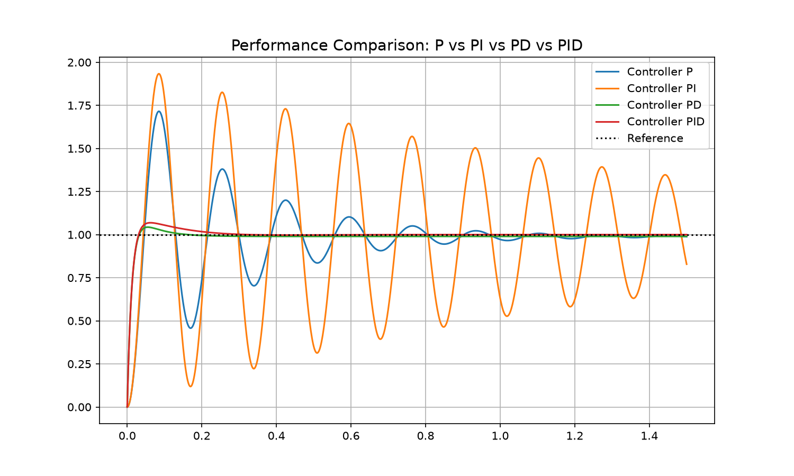
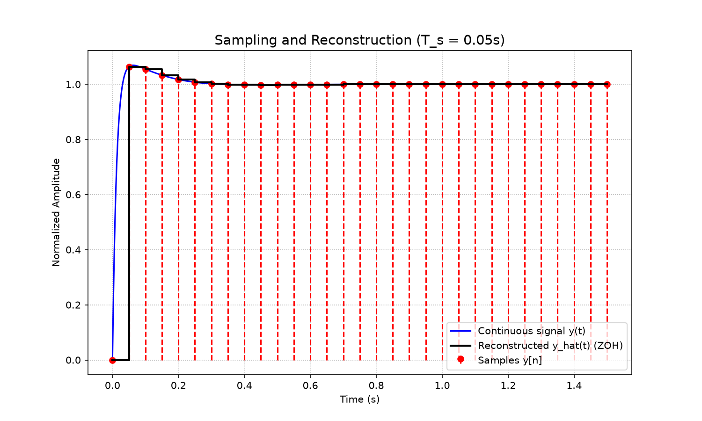
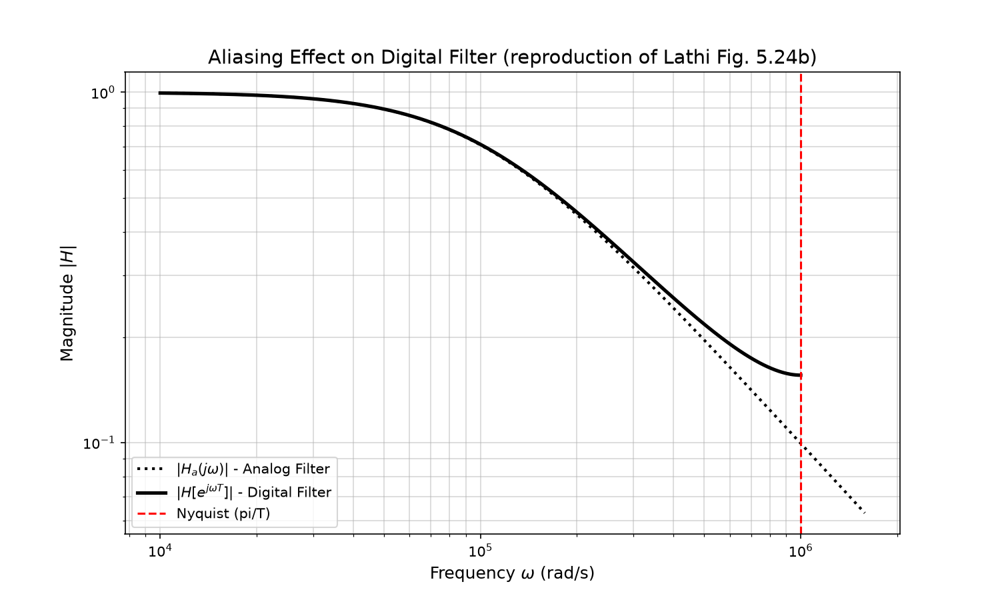

<<<<<<< HEAD
# MotorCC — DC Motor Modeling and Control

This repository contains a Jupyter notebook that models a DC motor with a nonlinear aerodynamic load (fan), linearizes the model around an operating point, designs PID controllers by pole placement, and demonstrates sampling/reconstruction and aliasing effects from Lathi.

## Contents
- `notebooks/01_dc_motor_modeling_and_simulation.ipynb` — exact copy of the notebook for distribution.
- `src/` — reusable simulation helper functions.
- `images/` — saved figures used in the README and report.

## Quick Start
1. Create a virtual environment (recommended):

	python -m venv .venv
	.venv\Scripts\activate

2. Install dependencies:

	pip install -r requirements.txt

3. Open the notebook in Jupyter or VS Code and run cells. To avoid re-saving images on each run, set `SAVE_IMAGES = False` in the top cell. To produce and save the included figures, set `SAVE_IMAGES = True` once, then commit the `images/` folder.

## Figures
Below are the key figures produced by the notebook. They are tracked in the repository under `images/` so they appear in this README without re-running the notebook.

### Normalized Step Response


### Ramp and Parabola Responses


### PID Closed-loop Response


### Controller Comparison (P, PI, PD, PID)


### ZOH Reconstruction


### Lathi — Aliasing Illustration


## Git / Commit Recommendations
To initialize the repository and commit the prepared assets:

```
git init
git add .
git commit -m "Initial: translated notebook, src module, images, README"
```

If you want me to run git commands here, confirm and I'll proceed.

## Notes
- `SAVE_IMAGES` toggle prevents repeated image creation; set it to `True` only when you want to (re)generate figures.
- I can also (optionally) move the exact notebook copy into `notebooks/` and verify file timestamps.

If you'd like any further adjustments (translate remaining strings, refine README text, or push to a remote), tell me which step to take next.
=======
# MotorCC — DC Motor Modeling and Control

This repository contains a Jupyter notebook that models a DC motor with a nonlinear aerodynamic load (fan), linearizes the model around an operating point, designs PID controllers by pole placement, and demonstrates sampling/reconstruction and aliasing effects from Lathi.

## Contents
- `ModelagemMotorCC.ipynb` — main notebook (translated to English, installer cell removed).
- `notebooks/01_dc_motor_modeling_and_simulation.ipynb` — exact copy of the notebook for distribution.
- `src/` — reusable simulation helper functions.
- `images/` — saved figures used in the README and report.

## Quick Start
1. Create a virtual environment (recommended):

	python -m venv .venv
	.venv\Scripts\activate

2. Install dependencies:

	pip install -r requirements.txt

3. Open the notebook in Jupyter or VS Code and run cells. To avoid re-saving images on each run, set `SAVE_IMAGES = False` in the top cell. To produce and save the included figures, set `SAVE_IMAGES = True` once, then commit the `images/` folder.

## Figures
Below are the key figures produced by the notebook. They are tracked in the repository under `images/` so they appear in this README without re-running the notebook.

### Normalized Step Response


### Ramp and Parabola Responses


### PID Closed-loop Response


### Controller Comparison (P, PI, PD, PID)


### ZOH Reconstruction


### Lathi — Aliasing Illustration


## Git / Commit Recommendations
To initialize the repository and commit the prepared assets:

## Notes
- `SAVE_IMAGES` toggle prevents repeated image creation; set it to `True` only when you want to (re)generate figures.
- I can also (optionally) move the exact notebook copy into `notebooks/` and verify file timestamps.

If you'd like any further adjustments (translate remaining strings, refine README text, or push to a remote), tell me which step to take next.
>>>>>>> 27b4212af6da5fe51b3466e723a0473b003aa2d0
